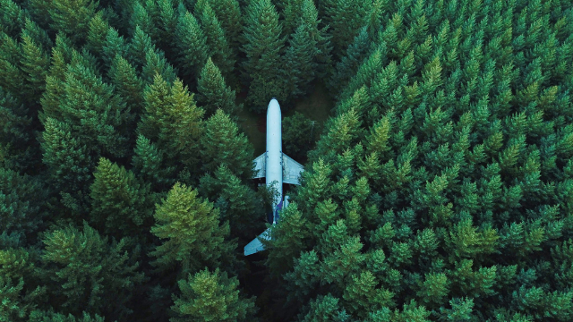
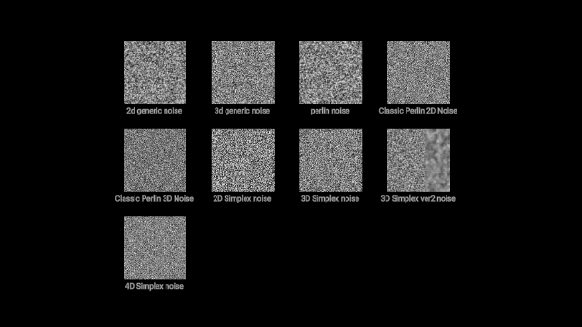
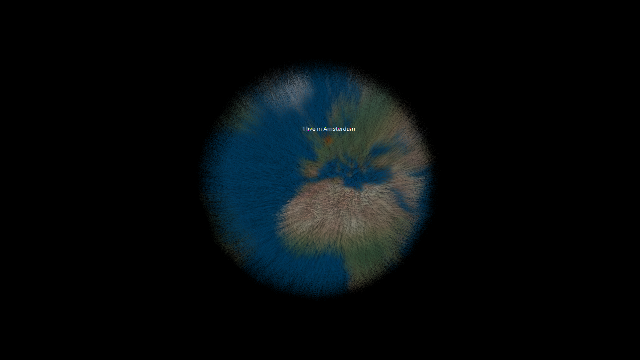
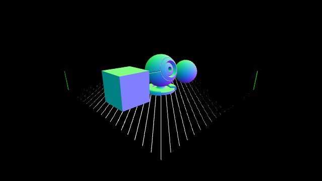

GitHub: [https://github.com/kenjiSpecial/tubugl-recipes](https://github.com/kenjiSpecial/tubugl-recipes)

### [00 - 2d-image-filter](./app00/index.html)

[codes](https://github.com/kenjiSpecial/tubugl-3d-shape/blob/master/examples/app00) 

[codes](https://github.com/kenjiSpecial/tubugl-recipes/tree/master/recipes/01-noise) 

[codes](https://github.com/kenjiSpecial/tubugl-recipes/tree/master/recipes/02-fur-earth) 

[codes](https://github.com/kenjiSpecial/tubugl-recipes/tree/master/recipes/03-load-json) 

### Skybox with cubemap texture

[codes](https://github.com/kenjiSpecial/tubugl-recipes/tree/master/recipes/04-cubemap-texture) 

all examples were made with [tubugl](https://github.com/kenjiSpecial/tubugl)
